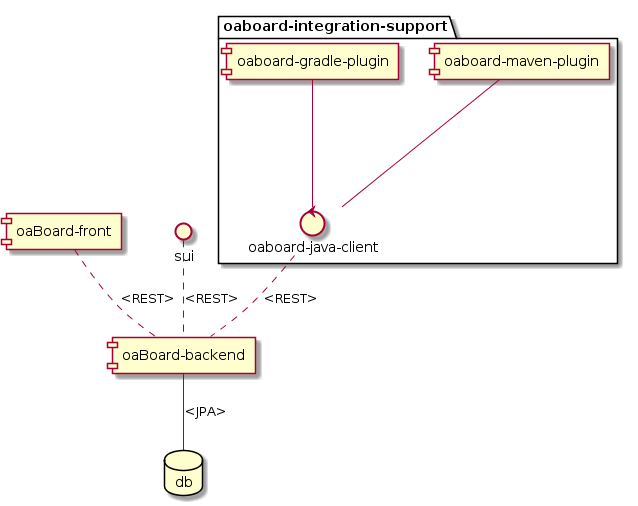
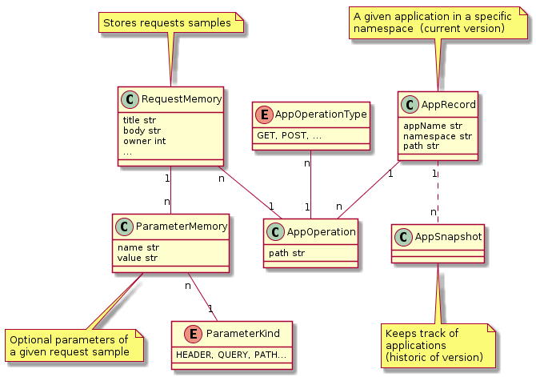

# oaBoard Components

OaBoard is composed of an application with backend and two front-end parts; and support tools.  

Here, there is a short description of each.  

Further information may be found on each repository.  

## Core modules

**oaboard-backend**

Backend server application, which connects to the database, accepts new records and provides all the information. 
It's based on JVM and Spring Framework, coded in Kotlin.  

**oaboard-frontend**

Provides the presentation layer, as a web application for accessing the OpenAPI definitions and managing app-records.  
   
It's a single page app based on Angular/Typescript.      

#### Lagacy: 

**swagger-ui-board**

> This was incorporated to oaboard-frontend

This is a fork of swagger-ui app (which is the view for openapi descriptions), with a few customization.  
In the future, it may include other opensource swagger-ui customization options.

## Support modules

**oaboard-maven-plugin** and **oaboard-gradle-plugin**, as their names suggest, are tools to make the interface with these java build tools (Maven, Gradle) easier.  

It doesn't mean that they are the only way to use oaBoard. 
You can rather use it with any language, just building a simple REST client for it.    

## Database 

